# Bienvenido, soy Adrián!

## Sobre mí
- Estudiante de CS de la Universidad de la Habana, Cuba.
- Comencé programando en C# pero he usado también Python y Assembly.
- He trabajado con Django, LaTeX, Jupyter Notebooks y Unity.
- Actualmente estoy trabajando en un bot de Telegram usando Python.

## Estadísticas

